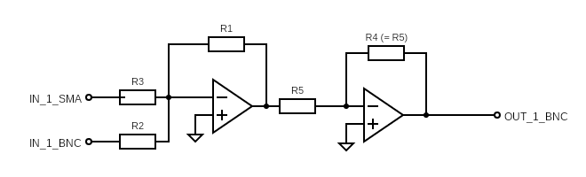

# Shot to shot feedback box
Programmable electronic boxes for discrete time PID feedback between experimental shots for ultracold atomic experiment. This low cost, plug-and-play device corrects for slow drifts in experimental parameters to keep shots consistent.

Feedback is performed as follows: an error signal from the experiment is fed into a Red Pitaya board, which calculates feedback and outputs an analog voltage. Then, using a PCB summing amplifier, this voltage offsets the external experimental setpoint. Thus, this repo includes feedback code for the Red Pitaya, the PCB design, and the CAD design for a case.

# Parts list
- Red Pitaya (STEMLab 125-14)
- Dual noninverting summing amplifier board (design in repo, needs parts)
- 3D printed enclosure: (CAD files in repo)

### PCB construction

The PCB schematic is pictured below. The choice of resistors will depend on the desired input/output voltage ratios, using the equation: (adder equation)
One board (which supports two output channels) requires the following parts:
- 2x AD706JNZ dual op amp (through-hole)
- 2x 90 degree SMA connector (PCB.SMAFRA.HT on Digikey)
- 6x 90 degree BNC connector (5227161-1 on Digikey)
- various resistors (through-hole)
- 0.33 uF capacitors

# Redpitaya instructions
### setup, packages
1. Install Red Pitaya software and connect to network ([link](https://redpitaya.readthedocs.io/en/latest/quickStart/OS_update/OS_update.html), [link](https://redpitaya.readthedocs.io/en/latest/developerGuide/software/console/ssh/ssh.html))
2. Install project-specific Red Pitaya package: (___)
3. Through the remote connection, copy feedback C code to desired Red Pitaya folder and compile

# Usage
question: how does it know when the error signal is being outputted? like how does RP know when a shot is over

### modular code
While all types of feedback will have the same general structure, the error signal input, feedback logic, and output will be different for each use case. Thus the C code includes multiple input, feedback, and output modules that are called by (main).

### examples
#### Tweezer position feedback
#### Sideprobe frequency feedback
